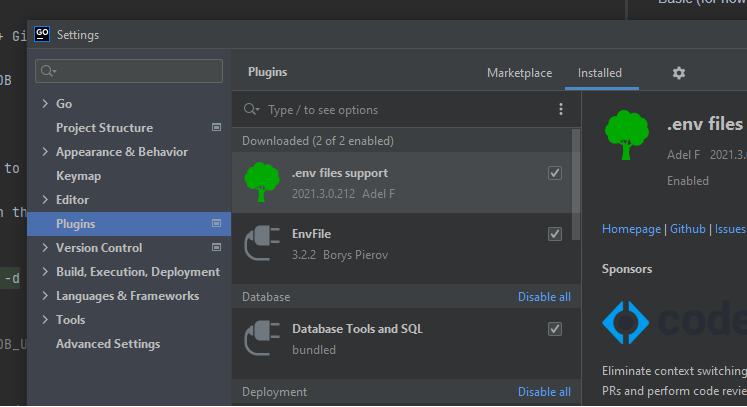
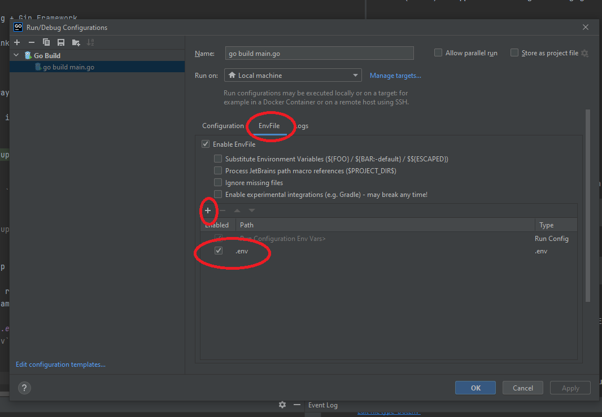

# Hackathon Organization Tool

Basic (for now) web application for hosting and managing hackathons and game jams.

## The Stack

Front End: Javascript + React

Back End: Golang + Gin Framework

Database: RethinkDB

## TO RUN

### Production
The suggested way to run the application is to change 

`DB_USE_HOST=1` in the `.env` file to `DB_USE_HOST=0` and run

```bash
docker-compose up -d
```

### Development

To develop, set `DB_USE_HOST=1` and run:

```
docker-compose up -d rethinkdb
```

This will set up the database container.

You should then run the `main.go` file from your preferred IDE, ensuring that the `.env`
file is being sampled by your run configuration.

#### Setting up .env file in GoLand
To use the `.env` file in GoLand, you'll need the `EnvFile` plugin and need to set up your run configuration to 
use the file.

Install plugin in `File->Setting->Plugins`


Set up run configuration:
